# HFT System Architecture Diagrams

## 1. System Architecture Overview

## 2. Data Flow Pipeline

```mermaid
flowchart LR
    A[📡 Market Data<br/>AAPL, TSLA] -->|WebSocket| B[Python Client]
    B -->|JSON Parse| C{Validate Bar}
    C -->|Valid| D[Format Data]
    C -->|Invalid| E[Log Error]
    D -->|PyKX Call| F[KDB+ Ingest]
    F -->|Insert| G[(realTimeData)]
    
    G -->|Timer: 10s| H[Process Engine]
    H -->|Query| I[Filter by Symbol]
    I -->|Calculate| J[Technical Indicators]
    
    subgraph Indicators
        J1[MA 20]
        J2[EMA 20/50]
        J3[RSI 14]
        J4[MACD]
        J5[Bollinger Bands]
    end
    
    J --> J1 & J2 & J3 & J4 & J5
    J1 & J2 & J3 & J4 & J5 -->|Insert| K[(trade Table)]
    K -->|Query| L[📊 Dashboard]
    
    style A fill:#e3f2fd
    style B fill:#fff9c4
    style G fill:#ffccbc
    style K fill:#ffccbc
    style L fill:#c8e6c9
```

## 3. Component Interaction Sequence

## 4. Processing Pipeline Detail

```mermaid
graph TD
    A[Raw Market Data] --> B{Symbol Filter}
    B -->|AAPL| C1[AAPL Dataset]
    B -->|TSLA| C2[TSLA Dataset]
    
    C1 --> D1[Check Min Records ≥5]
    C2 --> D2[Check Min Records ≥5]
    
    D1 -->|Yes| E1[Calculate Indicators]
    D1 -->|No| F1[Skip Processing]
    D2 -->|Yes| E2[Calculate Indicators]
    D2 -->|No| F2[Skip Processing]
    
    subgraph Indicator Calculations
        E1 --> G1[Moving Average 20]
        E1 --> G2[EMA 20/50]
        E1 --> G3[RSI 14]
        E1 --> G4[MACD + Signal]
        E1 --> G5[Bollinger Bands]
        
        E2 --> H1[Moving Average 20]
        E2 --> H2[EMA 20/50]
        E2 --> H3[RSI 14]
        E2 --> H4[MACD + Signal]
        E2 --> H5[Bollinger Bands]
    end
    
    G1 & G2 & G3 & G4 & G5 --> I1[Insert to trade]
    H1 & H2 & H3 & H4 & H5 --> I2[Insert to trade]
    
    I1 & I2 --> J[(Processed Data)]
    J --> K[Dashboard Visualization]
    
    style A fill:#e1bee7
    style J fill:#ffccbc
    style K fill:#c8e6c9
```

## 5. Trading Signal Detection

```mermaid
flowchart TD
    A[Processed Data] --> B{Check Indicators}
    
    B --> C1{Golden Cross?<br/>MA20 > EMA50}
    B --> C2{Death Cross?<br/>MA20 < EMA50}
    B --> C3{RSI < 30?<br/>Oversold}
    B --> C4{RSI > 70?<br/>Overbought}
    B --> C5{MACD Cross?<br/>Bullish/Bearish}
    
    C1 -->|Yes| S1[🟢 BUY Signal]
    C2 -->|Yes| S2[🔴 SELL Signal]
    C3 -->|Yes| S3[🟢 BUY Signal]
    C4 -->|Yes| S4[🔴 SELL Signal]
    C5 -->|Bullish| S5[🟢 BUY Signal]
    C5 -->|Bearish| S6[🔴 SELL Signal]
    
    S1 & S3 & S5 --> D1[Display BUY Alert]
    S2 & S4 & S6 --> D2[Display SELL Alert]
    
    D1 & D2 --> E[Update Dashboard]
    
    style S1 fill:#c8e6c9
    style S3 fill:#c8e6c9
    style S5 fill:#c8e6c9
    style S2 fill:#ffcdd2
    style S4 fill:#ffcdd2
    style S6 fill:#ffcdd2
```

## 6. System Deployment View

## 7. Data Schema

## 8. Error Handling Flow

## Technical Stack Summary

| Layer | Technology | Purpose |
|-------|-----------|---------|
| **Data Source** | Finazon WebSocket API | Real-time market data |
| **Client** | Python + websocket-client | WebSocket connection |
| **Bridge** | PyKX | Python-KDB+ interface |
| **Storage** | KDB+ (Port 5006) | Time-series data storage |
| **Processing** | Q Language (Port 5011) | Technical indicator calculations |
| **Visualization** | Streamlit + Plotly | Interactive dashboard |
| **Data Flow** | IPC/TCP | Inter-process communication |

## Key Features

- ⚡ **Real-time Processing**: 10-second update intervals
- 📊 **5 Technical Indicators**: MA, EMA, RSI, MACD, Bollinger Bands
- 🔄 **Auto-reconnect**: WebSocket resilience
- 📈 **Live Charts**: Candlestick + volume + indicators
- 🚨 **Trading Signals**: Automated buy/sell detection
- 🎯 **Multi-symbol**: Support for multiple stocks (AAPL, TSLA)

